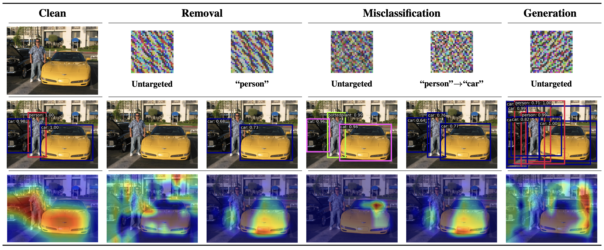
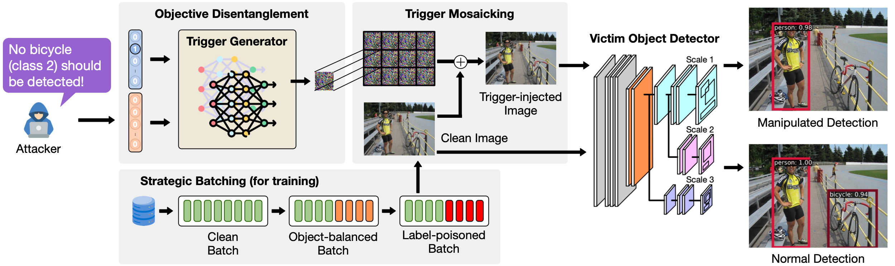

Deep neural networks (DNNs) have significantly advanced object detection, leading to their widespread integration into safety-critical applications. However, studies have shown that backdoor attacks can pose serious threats to their reliability. While prior research focuses on exposing their vulnerabilities to single-target static backdoor attacks, this work firstly explores the possibility of multi-target flexible backdoor attacks against object detection systems.

# Introducing AnywhereDoor

AnywhereDoor is a multi-target backdoor attack that enables dynamic control over the victim model's behavior. Once implanted, AnywhereDoor allows an attacker to selectively make objects disappear, fabricate new ones, or mislabel them, either all object classes or specific ones.

For instance, consider an image of a person standing between two cars. In the first column, the clean (unperturbed) input is correctly processed by the victim model, which detects all three objects. However, by applying stealthy triggers generated by AnywhereDoor—each corresponding to a different attack target (columns 2-6 in the first row)—the attacker creates poisoned inputs. Despite appearing visually identical to the clean version, these perturbed inputs induce critical misdetections:

- **Untargeted removal** (2nd column): No objects are detected.
- **Targeted removal** ("person" specified, 3rd column): Only the person is removed.
- **Untargeted misclassification** (4th column): Objects are detected but are randomly mislabeled.
- **Targeted misclassification** (5th column): The person is mislabeled as a car.
- **Untargeted generation** (6th column): Fake objects are detected.

The GradCAM heatmap illustrates how the trigger manipulates the victim model’s attention toward irrelevant regions, leading to these failures.



# How Does AnywhereDoor Work?



AnywhereDoor consists of three key modules:  (a) objective disentanglement, which generates the trigger based on the attacker’s desired target; (b) trigger mosaicking, which overlays the trigger on a clean input by tiling to ensure its effectiveness in any subregions; and (c) strategic batching, which forms batches dynamically during training. During optimization process, AnywhereDoor jointly trains a trigger generator network with the victim model. Once trained, the victim object detector exhibits desired malicious behaviors when the trigger presents while outputting normal detection results when receiving a clean image as input.

# Get Started with AnywhereDoor

To facilitate future research, we provide the source code of AnywhereDoor [[here]](https://github.com/HKU-TASR/AnywhereDoor).

1. **Python Environment:**

Clone the repository and navigate to the project directory:

```commandline
git clone https://github.com/HKU-TASR/AnywhereDoor.git
cd AnywhereDoor
```

Create and activate a conda environment:

```commandline
conda create --name anydoor python=3.11.9
conda activate anydoor
```

Install the required packages:

```commandline
pip install -r requirements.txt
```

Manually install the modified `mmdetection` and `mmengine`:

```commandline
pip install -v -e ./mmdetection
pip install -v -e ./mmengine
```

2. **Prepare Datasets:**

Download the VOC and COCO datasets and place them in the appropriate directories.

- [VOC2007](http://host.robots.ox.ac.uk/pascal/VOC/voc2007/)
- [VOC2012](http://host.robots.ox.ac.uk/pascal/VOC/voc2012/)
- [COCO 2017](https://cocodataset.org/#download)

Extract the downloaded files and place them in the `./data/<DATASET>` directory. The directory structure should look like this:

```
./data
├── VOC/VOCdevkit
│   ├── VOC2007
│   │   ├── Annotations
│   │   ├── ImageSets
│   │   ├── JPEGImages
│   │   ├── SegmentationClass
│   │   └── SegmentationObject
│   └── VOC2012
│       ├── Annotations
│       ├── ImageSets
│       ├── JPEGImages
│       ├── SegmentationClass
│       └── SegmentationObject
└── COCO
    ├── annotations
    ├── train2017
    └── val2017
```

3. **Prepare Pre-trained Models:**

We provide pre-trained models for download, including three object detectors and baseline and backdoor training results for two datasets (VOC and COCO). Download the pre-trained models from the following link:
[Pre-trained Models](https://drive.google.com/drive/folders/1X8upfe5zuRJO5evj_R5rJW_u5HE3PncN?usp=share_link)

Please place the `pretrained` directory in the root directory of the project, at the same level as `mmdetection`. The directory structure should look like this:

```
AnywhereDoor/ 
├── requirements.txt
├── assets/
├── mmdetection/ 
├── mmengine/ 
├── pretrained/ 
├── data/ 
└── README.md 

```

4. **Attack Effectiveness Evaluation:**

We provide a bash script `./mmdetection/evaluate.bash` to evaluate the main experimental results. Users can run this script to evaluate all pre-trained models at once:

```bash
bash ./mmdetection/evaluate.bash
```

You can also select specific commands from the script to run individual tests. If you want to write your own test commands, follow the format below:

```bash
python ./tools/test.py <CFG_PATH> <CKPT_PATH> --cfg-options <PARAMS_IN_MYCFG>
```

- \<CFG_PATH\>: Path to the configuration file.
- \<CKPT_PATH\>: Path to the checkpoint file.
- \<PARAMS_IN_MYCFG\>: Additional configuration parameters specific to your setup. For parameters's details, please refer to the configuration files in `./mmdetection/configs/_mycfg/`.
